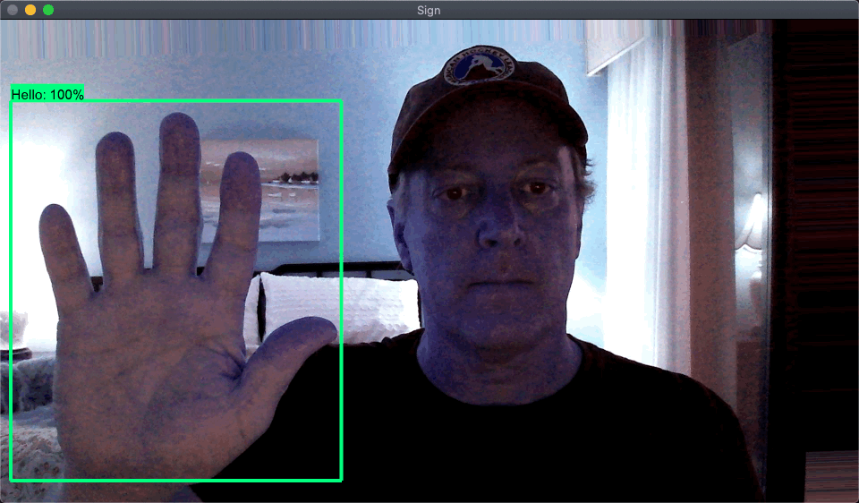
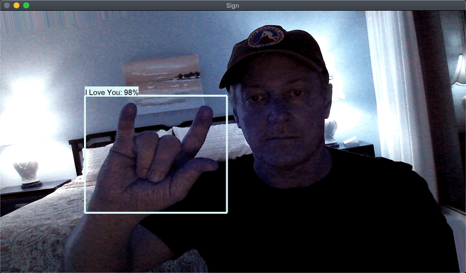
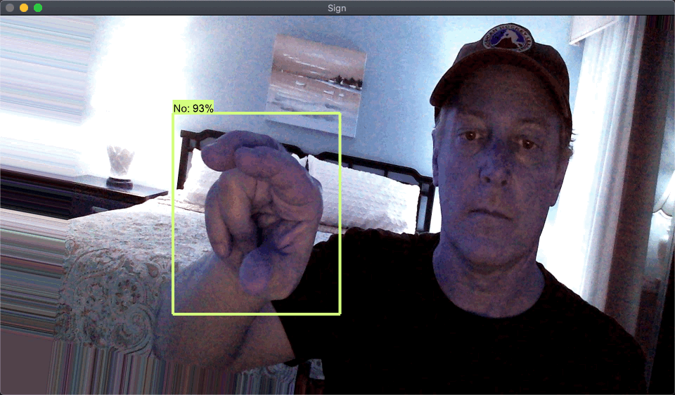
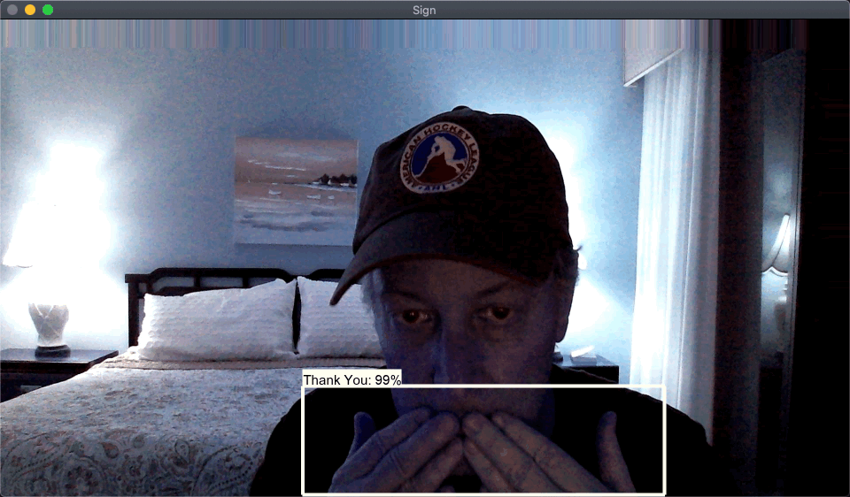
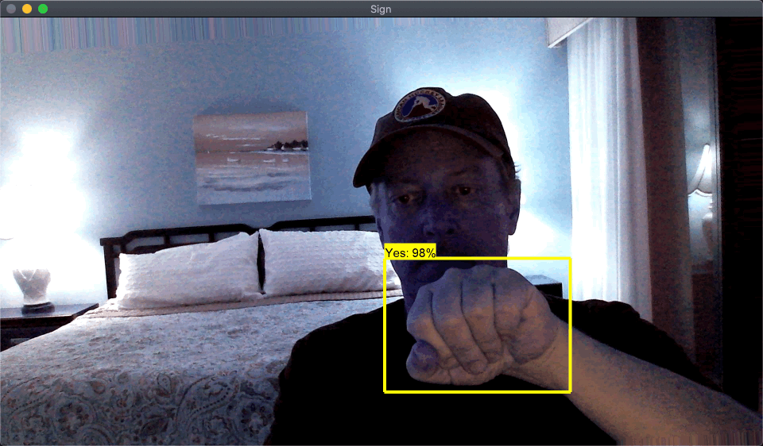

# Real-Time Sign Language Detection with Tensorflow Object Detection API 2.x

The project in this repo was completely inspired by [Nicholas Renotte](https://github.com/nicknochnack) and his wonderful YouTube Video [Real Time Sign Language Detection with Tensorflow Object Detection and Python | Deep Learning SSD](https://youtu.be/pDXdlXlaCco) tutorial.


<b>Test Images</b>












## Attribution

This repo is a collection of knowledge gained from others who so generously put together github repos and YouTube videos.  To you I say 'Thank you!'

### Tanner Gilbert

<b>Github Repos</b>

* [Tensorflow-Object-Detection-API-Train-Model](https://github.com/TannerGilbert/Tensorflow-Object-Detection-API-Train-Model)

* [Tensorflow Object Detection with Tensorflow 2.0](https://github.com/TannerGilbert/Tensorflow-Object-Detection-with-Tensorflow-2.0)

<b>YouTube Videos</b>

* [Tensorflow Object Detection with Tensorflow 2: Creating a custom model](https://youtu.be/cvyDYdI2nEI)

### Nicholas Renotte

<b>Github Repo</b>

* [RealTimeObjectDetection](https://github.com/nicknochnack/RealTimeObjectDetection)

<b>YouTube Videos</b>

* [Real Time Sign Language Detection with Tensorflow Object Detection and Python | Deep Learning SSD](https://youtu.be/pDXdlXlaCco)

* [Real Time Face Mask Detection with Tensorflow and Python | Custom Object Detection w/ MobileNet SSD](https://youtu.be/IOI0o3Cxv9Q)

### Jacob from Roboflow

<b>YouTube Videos</b>

* [How to Train EfficientDet in TensorFlow 2 Object Detection](https://youtu.be/yJg1FX2goCo)


## Tensorflow Documentation

You can find great Tensorflow documentation below.

[TF2 Object Detection API Tutorial](https://tensorflow-object-detection-api-tutorial.readthedocs.io/en/latest/install.html)

## My Contributions

While most of the heavily lifting in teaching about the TFOD API was done with the links above, I wanted to streamline the process and create scripts that will automatically setup an TFOD2 environment and provide a consistent process for building custom object detection models.

To that end, I have collected and/or written a number of scripts (see scripts directory) that will do much of the steps in building a custom object detector.  These steps are a combination of the steps I learned from Tanner, Nicholas and Jacob.

As much as is possible, the scripts are driven from values in the `scripts/model_config.py` file.  Most of the scripts do not need command line parameters - but - there are a couple.

## Caveats

* This repo was only tested on MacOS, Catalina

* This repo worked as of, January 23, 2021

* This technology changes so fast, it might not work in the near future.


## Steps

### [1] Create a Python 3.8+ Virtual Environment

Create this virtual environment in the root of this project.   

`TensorflowObjDetectionTemplate/venv`

This project was developed with Python 3.8.5

### [2] Activate Virtual Env

ACTIVATE THE VIRTUAL ENV

Or you will pollute your global python environment badly

`pip install -r requirements`

All of the libraries that I used are listed in `setup.py`


### [3] Update scripts/model_config.py file

* update TEMPLATE_ROOT_DIR

to Fully-Qualified Path to this repo root

* Make sure you have a section in the MODELS_CONFIG dictionary for the model you are interested in trying

* Search for TODO and update as appropriate

### [4] Setup Object Detection

Run the script:

`python scripts/setup-tf2-obj-detection.py`

This will perform a number of steps to setup TFOD models.  See the script for details, but the summary list is below:

     1 Clone Tensorflow Repos Dir

     2 Install the Object Detection API

     3 Verify TF ObjDet Install

     4 Fix tf_util bug

     5 install LabelImg

     6 download pretrained weights for selected model

     7 copy base config for model

     8 create label_map.pbtxt file, if it not not already there

     9 update model configuration file

### [5] Collect Images to train on

If you are capturing new images from your webcam, as we did for the sign language tutorial, then I recommend the script below:

For example, to capture 20 images labeled as 'Hello' in the collected-images (from model_config.py) directory you could issue the following command.

`scripts/video_capture_images.py --label Hello --num-images 20`

### [6] Optionally generated augmented images

To generate additional images from the originally collected images, use the `scripts/generate-augmented-images.py` script.  This script will use the images in a folder and generate the specified number of augmented images.

The generate augmented images script is designed to work on images in a single folder and augment each image in that folder with a specified number of images and write the augmented images to an output directory.

Edit the `scripts/generate-augmented-images.py` file to adjust the augmentation parameters.

`python scripts/generate-augmented-images.py --images-dir workspace/images/collected-images/hello --output-dir workspace/images/augmented-images/hello --per-image 4 --prefix hello`

### [7] Create a Train/Test/Holdout split

Create a train/test/holdout split of the collected or augmented images.

The images-dir points to a directory with subfolders and the splitting will happen in each of the subfolders to make sure the train/test/holdout split is evenly distributed across all of the label folders.

You do not need to have a holdout size.

The default test size is 0.2 or 20%.

This script will MOVE files from the images-dir to the output-dir into folders named train/test/holdout

`python scripts/train-test-split.py --images-dir workspace/images/augmented-images --output-dir workspace/images --test-size 0.2 --holdout-size 0.01`

### [8] Label the images

The tool that I have used is called `LabelImg`.  This tool is pip installed during Step 4.

To start this tool, in a terminal type:

```shell
labelImg
```

[1] The first thing I always do is:

`File->Reset All`

This will shutdown the tool, so you will have to restart.

This will reset any previously saved labeling efforts I did previously.

[2] Auto Save Mode

`View->Auto Save Mode`

[3] Open Dir

Open the directory to label.  In this case, since we did the train/test/holdout split prior to labeling you will select each of the train/test directories and label images in each directory.

[4] Change Save Dir

Make sure the save directory is the same as where the images are located.

Then run through each image and label them.

### [9] Create the TFRecords

Tensorflow wants the training and testing data in a tensorflow format.  Tensorflow provides a script to convert images and pascal_voc.xml annotation files to tfrecord format.

The script we are using comes from Tensorflow.

```shell
python scripts/generate_tfrecord.py -x workspace/images/train -l workspace/tf-annotations/label_map.pbtxt -o workspace/tf-annotations/train.record
python scripts/generate_tfrecord.py -x workspace/images/test -l workspace/tf-annotations/label_map.pbtxt -o workspace/tf-annotations/test.record

```

### [10] Train the model

You are now ready to train the model.  Run the script below 

`python scripts/model_train.py`

That script will use the model_config.py values to generate a script to run a Tensorflow script.

E.g.
python Tensorflow/models/research/object_detection/model_main_tf2.py --model_dir=Tensorflow/workspace/models/my_ssd_mobnet --pipeline_config_path=Tensorflow/workspace/models/my_ssd_mobnet/pipeline.config --num_train_steps=20000

This step will take some time.  As soon as you see it print out the loss for the first 100 steps you know it is in the process of training

### [11] Export the Trained Model

You could either use a checkpoint for the model as suggested by Nicholas or perform a model export as suggested by Tanner.

`python scripts/model_exporter.py`

This will put the exported model into `workspace/exported_models` by default.

### [12] Detect in Video (Thank you Tanner Gilbert)

You are now ready to run inferences.  In the case of the sign language project we want to capture images from the webcam.

NOTE:
#### Increase Detection Box Label Font on Mac

The default font does not exist on my Mac so it loaded_default which was very small.

This is a known issue in Tensorflow Community.  To fix this, I used the answer from [this StackOverflow](https://stackoverflow.com/questions/46950112/how-to-increase-the-font-size-of-the-bounding-box-in-tensorflow-object-detection)

Edit:
`venv/lib/python3.8/site-packages/object_detection/utils/visualization_utils.py`

Change:
`    font = ImageFont.truetype('arial.ttf', 24)`

To:

`    font = ImageFont.truetype('/Library/Fonts/Arial Unicode.ttf', 30)`

`python scripts/detect_from_video.py`


### [13] Detect in Image (Thank you Tanner Gilbert)

If you are detecting objects in images use the:

`python script/detect_from_image.py`

See that file for the parameters.

## Congratulations

If you made it this far you should have a working sign language object detection model.

## Additonal Resource Links

### Tensforflow Model Zoo

https://github.com/tensorflow/models/blob/master/research/object_detection/g3doc/tf2_detection_zoo.md


